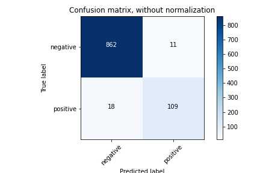

# Inference

 

TF-TRT를 이용해서 Inference의 성능을 향상시키자.

 

### Files

- inference_test.ipynb

  TensorRT 사용해보기

 

- inference_compare.ipynb

  TRT 사용 시 성능 비교

 

- cxr_inference.ipynb

  Chest X-ray를 이용해서 COVID19 진단 

 

### Performance evaluation

- native

 

- FP16

  