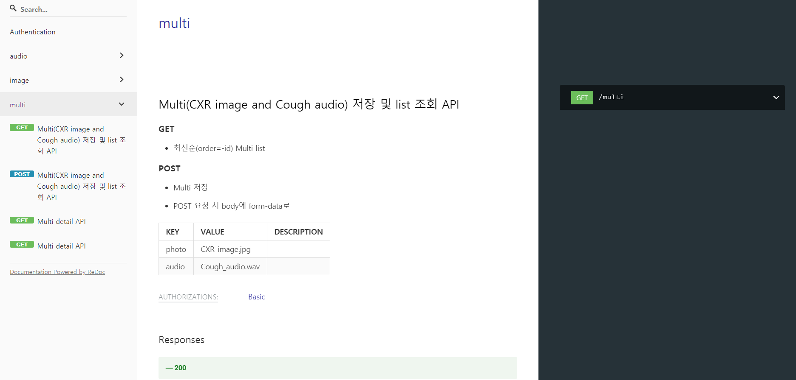
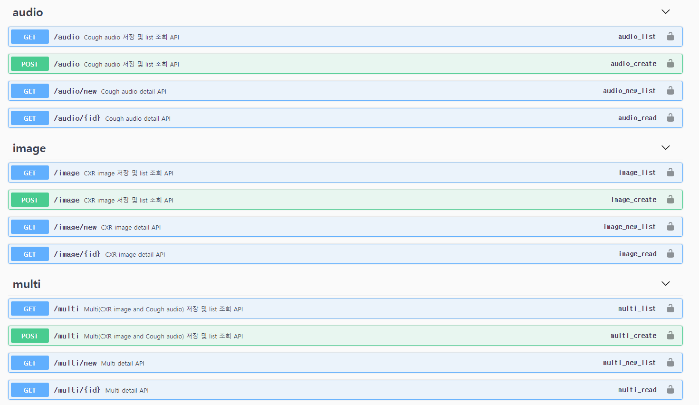

# Beckend REST API

### using Django rest framework


<br/>

흉부 X-ray(CXR) 이미지와 기침 소리를 이용해서 COVID19를 진단하는 서비스


<br/>

담당

DRF: 양시영

Image model: 정진균

Audio model: 김주연


<br/>

기간: 2020년 10월 12일 ~ 2020년 11월 13일


<br/>

### INSTALL

```
pip install django

pip install djangorestframework

pip install django-cors-headers

pip install librosa
```


<br/>

### run

```
python manage.py runserver
```


<br/>

### API docs

#### docs

http://localhost:8000/docs

<br/>




<br/>

#### swagger

http://localhost:8000/swagger

<br/>




<br/>